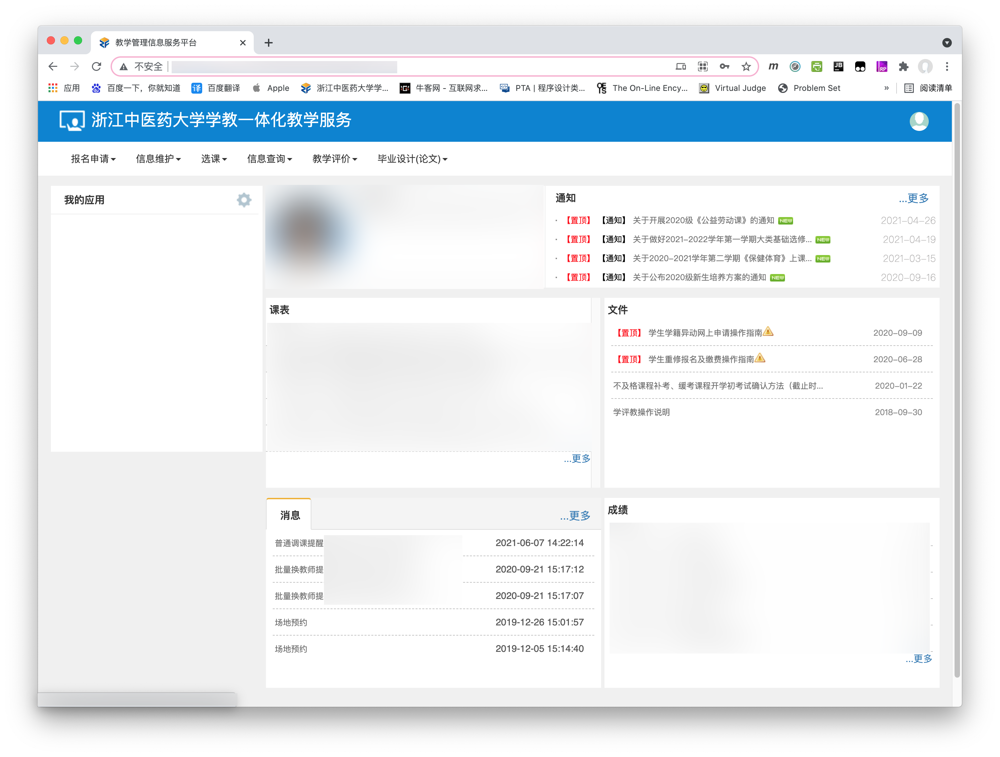
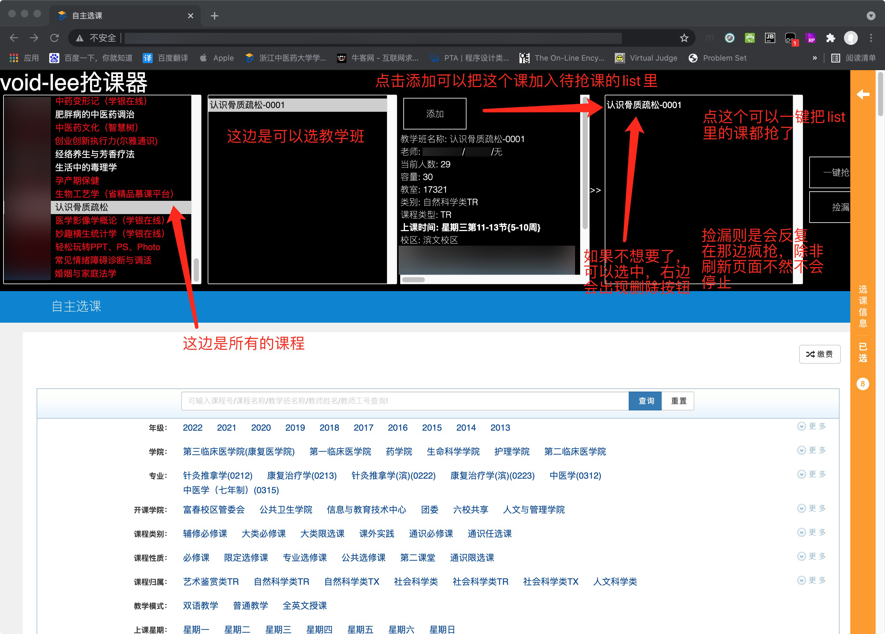

# ZFCourseTakingAssistant
A script for Chinese University Student grabbing courses with Zheng Fang Educational administration system.

一款面向正方教学一体化教育服务系统（浙江中医药大学）的抢课脚本。

# Features

* 支持一键抢课（提前进入网站，预先选好要的课程，到了抢课的时间一键抢课）
* 支持捡漏（可以自动反复抢列表里的课）

> **程序仅供交流学习，请勿用作非法用途，一经发现将追究法律责任**

# Applicable

本脚本适用于**新版正方教学一体化教育服务系统**。

目前仅测试过**浙江中医药大学**和**杭州电子科技大学**(此处感谢[@weixiabing](https://github.com/weixiabing ))的教务系统，欢迎其他学校的同学测试后提交issue。

## Environment

* Google Chrome
* Tampermonkey

建议使用安装了Tampermonkey(油猴脚本插件)的谷歌浏览器，其他浏览器没有测试过不敢保证稳定性。

**经测试，火狐浏览器也有不错的效果，安装Tampermonkey插件不需要翻墙，适合安利给妹纸。**

## Usage

1. 安装油猴子，安装本脚本[https://raw.githubusercontent.com/Void-JackLee/ZFCourseTakingAssistant/main/抢课脚本.user.js](https://raw.githubusercontent.com/Void-JackLee/ZFCourseTakingAssistant/main/%E6%8A%A2%E8%AF%BE%E5%8A%A9%E6%89%8B.user.js)

2. 访问你的选课网址，待他加载完毕后如图所示。（可以按F12打开控制台查看详情）

红色代表没有余量，白色代表还可以选。

**已知问题：如果过了好久都没显示，强制刷新（快捷键：control+shift+R/command+shift+R）即可，是缓存问题。**

# Development

## Environment

* Unix Base System(Linux/Unix/macOS)
* WebStorm
* node.js
* webpack
* css-loader
* style-loader

## Build

Run `build.py` script in project folder to build.

